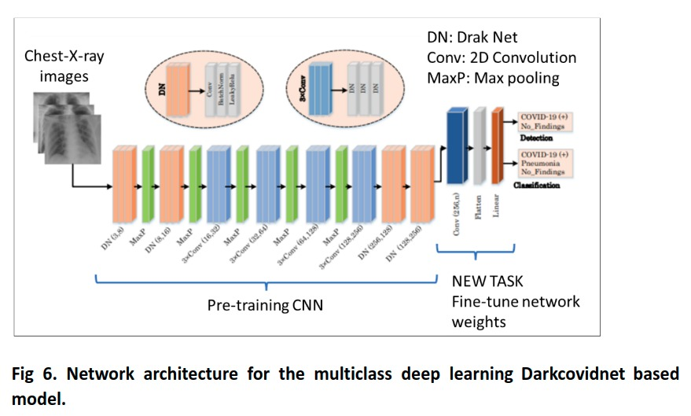

# Multiclass classification model 

Model to detect 3 classes:

- COVID : person carrying SARS-CoV-2
- NORMAL : person without any disease
- PNEUMONIA : person with a lung disease Pneumonia.

Transfer learning of e DarkCovidNet model use modificated networks DarkNet-19with fewer layers. The DarkCovidNet model obtained a sensitivity of 90%.
74% with a accuracy of 85%.

# Dataset
  - Three_Classes: https://drive.google.com/drive/folders/1aSIFG1mR3RMmC0JWCryl7upfiGgrl6Rd?usp=sharing
  - Binary_Classes: https://drive.google.com/drive/folders/1f2Pd7bVxQ1_fGyy5LSF6I6wEbgu-KYSb?usp=sharing

# Methodology

 A dataset consisting of 844 training, 281 validation and 600 test datasets has been formed. The data set is described in table 4, where it can be seen that the data is unbalanced.

    

The DarkCovidNet  model has 17 convolution layers, followed by BatchNorm and LeakyReLU operations. While each 3xConv layer has the same setup three times in successive. The batch normalization(BatchNorm) is used to standardize the inputs, reducing training time and increasing stability of the model. LeakyReLU is a variation of the ReLU. The Maxpool method is used in all the pooling operations. Our model, three different classes of images are used in the input classification to determine the labels of the input chest X-ray images COVID-19, pneumonia or NoFindings.

    

# Results

It can be noted from Fig.9A that there is a significant increase in loss values in the beginning of the training, which decrease substantially in the later stage of the training. The main reason for this sharp increase and decrease is attributed to the number of data in the COVID-19 class, which is far less than the other two (Pneumonia and No-Findings) classes. The DarkCovidNet model achieved an average classification accuracy of 85.05% Unlike the model proposed by Ozturk et al. [17] with an accuracy of 87.02% to classify: no findings, COVID-19, and Pneumonia categories (Fig 9C); this non-significant difference of approx. 2% is because in their work they only reference the division of the dataset in 80 to 20, so when doing this division randomly the results may vary a bit. Sensitivity, specificity, precision, F1-score, and accuracy values are shown in Fig 9C for the detail analysis of the model for the 3-class problem. The confusion matrix is shown in Fig. 9, reaching a sensitivity of 0.741 and an accuracy of 0.85 in covid recognition. 

The model performed well over 85% in detecting COVID-19 cases for the three-class task (COVID-19, pneumonia, and no findings). The advantage of including pneumonia in the model is that covid will not be confused with dihca disease, since the similarity is very close, making the model more robust. What is remarkable about this model is that it works with more than 1500 data without generating errors, unlike other models that work with fewer images, such as the one by Ioannis et al [32]. and DarkCovidNet is proposed based on DarkNet, the model classified the chest X-ray images without using a feature extraction technique.
