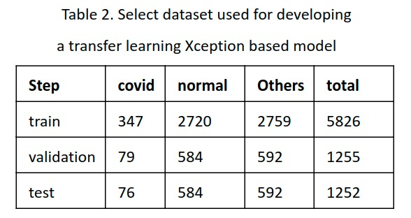

# Multiclass classification model 

Model to detect 3 classes:

- COVID : person carrying SARS-CoV-2
- NORMAL : person without any disease
- NON COVID : person with a lung disease other than covid (Pneumonia).

Transfer learning of 3 neural networks Xception, DenseNet121 and VGG16 was used. The best model was an Xception network with a sensitivity of 90%.
network with a sensitivity of 90%.

# Dataset
  - https://drive.google.com/file/d/1CmrRt4Uyl3lGTgYKMWkouzfGPU_W47Nj/view?usp=sharing

# Getting Started
    
    
    # install libraries
    
        $ pip install -r requirements.txt

    # download dataset folder and unzip it automatically
    
        $ python download.py
    
    # Train the model
    
        $ python training.py
    
    # Evaluate the model
    
        $ python evaluate.py
    

# Methodology

In the work of Rahimzadeh & Attar (2020), they use a combination of two convolutional neural networks called Xception and Resnet50, with 11302 images to report the actual accuracy in real circumstances with 3 different categories such as covid, normal and pneumonia. The average accuracy of the proposed network to detect COVID-19 cases is 99.56%, and the overall average accuracy for all classes is 91.4%, sensitivity is 80% and specificity is 99%. From this work, the importance of using 3 classes for prediction is emphasized because some x-ray images are from healthy people and the others may be from people with sarcov2 or other lung diseases. In conclusion, a neural network has been proposed that can predict 3 types of cases: covid, normal and other lung diseases.
The proposed architecture consists of a base network called Xception and fully connected layers as shown in figure 4. 

    

A dataset consisting of 5826 training, 1255 validation and 1252 test datasets has been formed. The data set is described in table 2, where it can be seen that the data is unbalanced. 

    

# Results

Training of the data was performed with the cost function focused on covid detection and an f1 metric to be able to see the progress of covid detection at each epoch. An early stopping using the validation data has been used and convergence is reached in 172 training epochs. The results are shown in the Fig.5C for the training, validation and test data. The confusion matrix is shown in Fig. 5B, reaching a sensitivity of 0.975 and a specificity of 0.947 in covid recognition. 

Fig. Results of training and testing of deep learning Xception based model. A. Plot of training. B. Confusion matrix. C. Results taking in account several different metrics to quantify the performance of the proposed model. 

    

As can be seen in the results of a total of 1252 images in the test, a high sensitivity was obtained in comparison to other models (Rahimzadeh et, al, Narin et al), this model is robust to unbalanced data and achieves differences in pulmonary diseases very similar to covid such as pneumonia. Better results were obtained using a more complex architecture, with more dense layers, dropout layers and a focal cost function. The dense layers and dropout allow the model to learn the differences between the Covid-19 and other diseases, even though these images are very similar. The focal cost function allows us to keep our attention on learning the covid detection even though most of the data is pneumonia, avoiding the overfitting by unbalanced data.  Obtaining a satisfactory result in the test data of an average accuracy of 0.984 and sensitivity of 0.975 and a specificity of 0.947 in the covid recognition.

