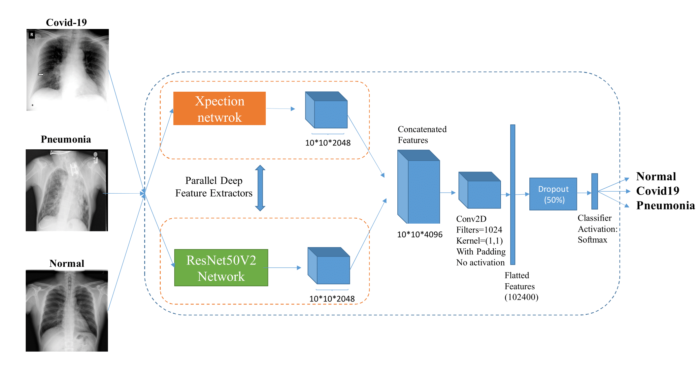

This code has been reproduced in order to understand how neural networks work in the detection of covid and to compare the results with my created model.

# A modified deep convolutional neural network for detecting COVID-19 and pneumonia from chest X-ray images based on the concatenation of Xception and ResNet50V2

COVID-19 has become a serious health problem worldwide.  This virus has been confirmed to have claimed more than 126,607 lives to date. Since the beginning of its spread, many Artificial Intelligence researchers developed systems and methods to predict the behavior of the virus or detect infection. One of the possible ways to determine the patient's infection to COVID-19 is through the analysis of chest X-ray images. Since there are a large number of patients in hospitals, it would be time-consuming and difficult to examine many X-ray images, so it may be very useful to develop an AI network that does this work automatically.  In this work, we have trained several deep convolutional networks with the introduced training techniques to classify X-ray images into three classes: normal, pneumonia, and COVID-19, based on two open source datasets. Unfortunately, most previous work on this topic has not shared their dataset, and we had to deal with few data on COVID-19 cases. Our data contains 180 X-ray images belonging to COVID-19 infected individuals, so we tried to apply methods to get the best possible results. In this research, we introduce some training techniques that help the network to learn better when the dataset is unbalanced (we have few COVID-19 cases), and we also propose a neural network that is a concatenation of Xception and ResNet50V2 networks. This network achieved the best accuracy by using multiple features extracted by two robust networks. In this work, despite other research, we have tested our network on 11302 images to report the actual accuracy that our network can achieve in real circumstances. The average accuracy of the proposed network to detect COVID-19 cases is 99.56%, and the overall average accuracy for all classes is 91.4%. Code of the paper available at the following link  https://github.com/mr7495/covid19

Download files 

1- https://github.com/ieee8023/covid-chestxray-dataset

2-https://www.kaggle.com/c/rsna-pneumonia-detection-challenge 

The neural network uses a containment of two networks, ResNet50V2 and Xception. 

	
	 
	<em>CNN architecture</em>

