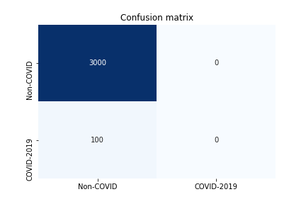
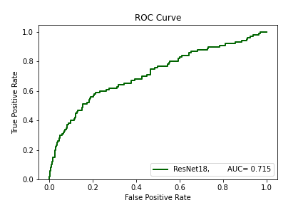
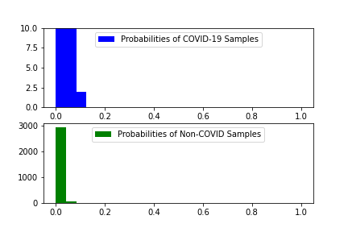

# Deep-COVID

Predicting COVID-19 From Chest X-Ray Images Using Deep Transfer Learning
This paper wrote by Shervin Minaee, Rahele Kafieh, Milan Sonka, Shakib Yazdani, Ghazaleh Jamalipour contributes to early diagnosis with the objective of provide a inmediate isolation of the suspected person and to break transmission chains. First of all, this paper prepare a Chest-Xray-5k dataset that contains 2084 training and 3100 images between COVID-19 and Non-COVID images. This dataset is thinking to be use as a benchmark for the research community. Without a doubt, Chest-Xray-5k is a big contribution to overcome the low number of samples for the COVID-19 class. In spite of mixing images from different sources is not enough quantity of samples, for this reason, researchers used data augmentation to create transformed version of COVID-19 images to increase the number of samples by a factor of 5. Once, they got the final samples of COVID-19, They train four deep learning models: 

    • ResNet 18
    • ResNet 50 
    • SqueezeNet
    • Dense Net

SquezeNet and ResNet18 reached the best values with 98% for sensitivity rate and 91% for specifity rate in average considering different thresholds. For instance, the paper proposed other metrics to see the overall comparison between those four models. Aditionally, to sensibility and specifity, investigators used precision recall and AUROC, in which SqueezeNet was the best model, but ResNet18 is not far away. Moreover, they used ResNet18 to generate and show heatmaps that contained most of the infected areas annotated by their board certified radiologists.  
ResNet 18 code is publicly available, I reproduced this model adjusting all parameters similar to the  hyper-parameters founded in the paper and only chance the number of epoch to 150. We reached a 96.77% of acurracy for training. So then, We applied this training model in the data test, we percieved that ResNet18 didn’t differenciate COVID-19 of Non-COVID-19 . All the images are considered Non-COVID as shown in the figure of the confusion matrix. Also, it is strange that AUC ROC was 0.715 that means that our  model can distinguish a normal from an abnormal patient based on the image information, see the Figure of roc.

    

    

    

# Reference

S. Minaee, R. Kafieh, M. Sonka, S. Yazdani, and G.J. Soufi.  “Deep-covid: Predicting covid-19 from chest x-ray images using deep transfer learning”. Medical image analysis, 65, p.101794.
 
