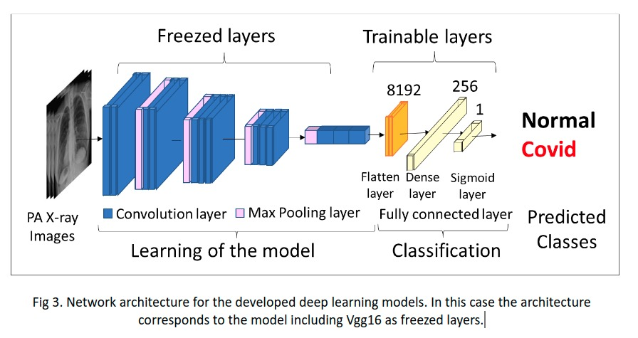

# Detection of COVID-19 in post-anterior X-ray images by Deep Learning

The  novel  coronavirus  2019  (COVID-19)  expands over  the  world  has  implied  many  challenges  for  health  systems like  diagnostic  methods  acquisition  of  high  sensibility  and  low cost-benefit. Its impact is major in middle-low income countries, it affects extremely poor places.  On the other hand, the shortage of human potential in such areas leads to late diagnosis of patients. In  response  to  this  gap,  the  present  paper  through  Xception,VGG,  DarkNess,  (complete  models)  seeks  to  discern  chest  X-rays positive for COVID-19 from normal and other pathologies. Also, to provide a score for severity in case the radiographs are positive for COVID-19.

## METHODOLOGY

## 1. Detection dataset

In this study, we used chest x-ray images obtained from several sources. Initially we collected x-ray images consider anteroposterior (AP) and posteroanterior (PA) projections, but for classification models only PA images were used. The new dataset that contains 12027 images between COVID-19, NORMAL and NO_COVID (Fig. 1), was divided into AP and PA projection. Our dataset is available here https://drive.google.com/file/d/1CmrRt4Uyl3lGTgYKMWkouzfGPU_W47Nj/view?usp=sharing.

    

Our dataset,  enter each dataset into a carpet that also contains PA and AP projection and each projection was divided into COVID, NON-COVID and NORMAL. Once all the datasets have been organized, we run codes to classify all the data into two big groups PA and AP projections.  At the end we obtained the following proportion of samples in the three classes: 

    

## 2. Deep learning models for detection of Covid-19
Taking in account our objective of generate useful deep learning models for detection and diagnosing of severity of infection by SARS-Cov2, we perform the development of different models at the same time. In the case of models for Covid-19 detection: binary classification models for evaluating several transfer learning convolutional networks, and multiclass classification models using more complex neuronal network architectures and using less conventional transfer learning models. In the case of the generation of model for diagnosing the severity of the disease, we have uses a pretrained deep learning model for determination of features by image and a linear regression model for the determination of grade of severity of Covid-19 using as objective variables the opacity and geographic means values of each x-ray image. 

### 2.1 Binary classification models

This model is trained with the dataset covid-chestxray from https://github.com/ieee8023/covid-chestxray-dataset. The pre-processed image data was then split into training and validation sets (424 images Covid-19 and 425 images normal), and test sets (662 images), from which we have used the training and validation data to train and validate our models. 

    

### 2.2 Multiclass classification models -  Xception based model

The proposed architecture consists of a base network called Xception and fully connected layers as shown in figure x. We used our dataset consisting of 5826 training, 1255 validation and 1252 test datasets has been formed. The data set is described in table 1, where it can be seen that the data is unbalanced. 

The dataset was split as shown in the table 2.

    

As the data are unbalanced, it is proposed to use a weighted - crossentropy cost function, to penalize the covid detection error and not to overfit the data while preserving a balanced sensitivity and specificity in training and validation.

    

### 2.2 Multiclass classification models - Darkcovidnet based model

 A dataset consisting of 844 training, 281 validation and 600 test datasets has been formed. The data set is described in table 4, where it can be seen that the data is unbalanced.

    

The DarkCovidNet  model has 17 convolution layers, followed by BatchNorm and LeakyReLU operations. While each 3xConv layer has the same setup three times in successive. The batch normalization(BatchNorm) is used to standardize the inputs, reducing training time and increasing stability of the model. LeakyReLU is a variation of the ReLU. The Maxpool method is used in all the pooling operations. Our model, three different classes of images are used in the input classification to determine the labels of the input chest X-ray images COVID-19, pneumonia or NoFindings.

    

### 3. Results

### 3.1 Binary classification models

The evaluation results of the deep learning neural networks are presented in Fig.  which shows the confusion matrices of each network for fold one to two. 

    

Our results are detailed reporting five different metrics for evaluating the performance of the models for each of the two classes (table 3). According to our results, Xception outperformed the other four deep-learning models, achieving an overall classification accuracy of 100 %.

    

### 3.2 Multiclass classification models -  Xception based model

Training of the data was performed with the cost function focused on covid detection and an f1 metric to be able to see the progress of covid detection at each epoch. An early stopping using the validation data has been used and convergence is reached in 172 training epochs. The results are shown in the Fig.5C for the training, validation and test data. The confusion matrix is shown in Fig. 5B, reaching a sensitivity of 0.975 and a specificity of 0.947 in covid recognition. 

    

As can be seen in the results of a total of 1252 images in the test, a high sensitivity was obtained in comparison to other models (Rahimzadeh et, al, Narin et al), this model is robust to unbalanced data and achieves differences in pulmonary diseases very similar to covid such as pneumonia. Better results were obtained using a more complex architecture, with more dense layers, dropout layers and a focal cost function. The dense layers and dropout allow the model to learn the differences between the Covid-19 and other diseases, even though these images are very similar. The focal cost function allows us to keep our attention on learning the covid detection even though most of the data is pneumonia, avoiding the overfitting by unbalanced data.  Obtaining a satisfactory result in the test data of an average accuracy of 0.984 and sensitivity of 0.975 and a specificity of 0.947 in the covid recognition.

### 3.3 Multiclass classification models - Darkcovidnet based model

It can be noted from Fig.9A that there is a significant increase in loss values in the beginning of the training, which decrease substantially in the later stage of the training. The main reason for this sharp increase and decrease is attributed to the number of data in the COVID-19 class, which is far less than the other two (Pneumonia and No-Findings) classes. The DarkCovidNet model achieved an average classification accuracy of 85.05% Unlike the model proposed by Ozturk et al. [17] with an accuracy of 87.02% to classify: no findings, COVID-19, and Pneumonia categories (Fig 9C); this non-significant difference of approx. 2% is because in their work they only reference the division of the dataset in 80 to 20, so when doing this division randomly the results may vary a bit. Sensitivity, specificity, precision, F1-score, and accuracy values are shown in Fig 9C for the detail analysis of the model for the 3-class problem. The confusion matrix is shown in Fig. 9, reaching a sensitivity of 0.741 and an accuracy of 0.85 in covid recognition. 

    

The model performed well over 85% in detecting COVID-19 cases for the three-class task (COVID-19, pneumonia, and no findings). The advantage of including pneumonia in the model is that covid will not be confused with dihca disease, since the similarity is very close, making the model more robust. What is remarkable about this model is that it works with more than 1500 data without generating errors, unlike other models that work with fewer images, such as the one by Ioannis et al [32]. and DarkCovidNet is proposed based on DarkNet, the model classified the chest X-ray images without using a feature extraction technique.

## 4. Conclusions

In this study, we hypothesised that computer-aided deep learning algorithms can accurately allow Covid-19 detection and classification of severity on chest X-ray images associated with SARS-CoV-2 infection, and the results of study support this hypothesis. Taking in account the results obtained with binary classification models, three of the models have an accuracy over 90%, having the best model based in Xception a value of 100%, and when the complexity of the data was increased adding chest X-ray images associated with diverse pathologies, the accuracy using a Xception transfer deep learning was 94%. We have tried to generate robust mix of deep learning and regression models, but there are limitations like imbalance datasets, few labelled images to train and test. We have had only 82 images for that purpose. However, this procedure was shown also useful for determination of severity, when we used all the futures as independent variables for a support vector  machine model for detection with an overall accuracy of 96.97%. 

